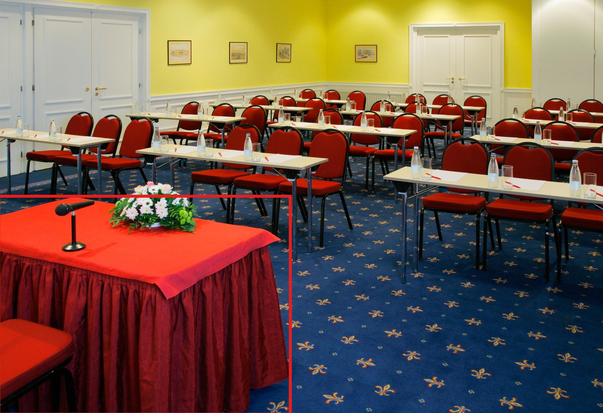

# Typed Affordance Reasoning with Frontier VLMs

**ECCV 2026 Workshop X-Reason** — *Visual Perception and Reasoning in the Interactable World*

This project evaluates whether frontier Vision-Language Models (VLMs) can reason about **affordances**
— not just *whether* an action is possible, but the **type** of constraint (physical, functional,
social, or safety) that makes it appropriate or forbidden.

We evaluate four standard frontier VLMs — **GPT-5.5, Claude Sonnet 5, Gemini 3.5 Flash,
Llama 4 Maverick** — plus the chain-of-thought reasoning model **o4-mini** on the hardest judgments.

**Headline finding:** models largely agree on *whether* an action is possible but diverge sharply on
*why* it is not. Typed attribution, not the binary can/cannot judgment, is where today's VLMs disagree,
and explicit chain-of-thought helps but is not necessary.

> This README documents the full framework, procedure, metrics (in more detail than the paper), and
> **all** results. The paper is the condensed version; this is the reference.

---

## 1. Framework

### 1.1 The question

Knowing *what* an object is says little about *whether* you can act on it, or *why* you cannot — it
might be broken, blocked, socially off-limits, or dangerous. A binary "can / cannot" answer collapses
all of these into one bit. We ask VLMs to name the **type** of constraint instead.

### 1.2 The 7-way taxonomy

We adopt the affordance-relationship taxonomy of **ADE-Affordance** (Chuang et al., CVPR 2018). Codes
2–6 are *exception* categories: predicting one also requires a grounded one-sentence **explanation** and
**consequence**.

| Code | Category | Meaning |
|------|----------|---------|
| 0 | **Positive** | Action is appropriate and feasible |
| 1 | **Firmly Negative** | Inappropriate, with no specific reason (residual bucket) |
| 2 | **Object Non-functional** | The object's condition (broken, depleted) prevents it |
| 3 | **Physical Obstacle** | A scene constraint blocks it |
| 4 | **Socially Awkward** | Possible but contextually inappropriate |
| 5 | **Socially Forbidden** | Violates a strong social or legal norm |
| 6 | **Dangerous** | Poses a physical safety risk |

Codes 0–1 answer *whether*; codes 2–6 answer *why not*. Most (instance, action) pairs are code 1
(a soap dish does not afford *sit*), so the exception categories are rare (2–4% each) — this drives the
metric choices below.

### 1.3 Two complementary experiments

Because a dataset with typed labels exists for only three actions, we pair a **ground-truth** experiment
with a **ground-truth-free** one:

| | **Experiment A** — accuracy | **Experiment B** — reliability |
|---|---|---|
| Question | Are the typed judgments *correct* vs. labels? | Does the pattern *hold* where no labels exist? |
| Ground truth | ADE-Affordance labels | none (inter-model agreement) |
| Actions | `sit`, `run`, `grasp` (ADE-Affordance) | `sit_on`, `hold`, `carry`, `cut`, `throw`, `ride` (AGD20K vocabulary) |
| Instances | ADE-annotated (isolates reasoning from detection) | SAM-proposed (full annotation-free pipeline) |
| Scale | 200 images / 13,512 (instance, action) pairs / 579 exceptions | 200 curated ADE20K validation scenes |

The action sets overlap (`sit_on`≈`sit`, `hold`/`carry`≈`grasp`) so A validates a slice of B, while B
extends to actions ADE cannot label (`cut`, `throw`, `ride`).

---

## 2. Procedure

Both experiments issue the **same query**: the full scene image plus a crop of the target instance, and
a structured system prompt that defines the taxonomy and requires strict JSON —
`{"relationship_label": <0–6>, "explanation": <str>, "consequence": <str>}` at temperature 0.

### 2.1 Experiment A — GT-grounded typed evaluation

1. **Data prep** (`build_instance_masks.py`) — fetch the ADE20K images for the ADE-Affordance test split
   from the HuggingFace mirror `1aurent/ADE20K`; the instance id is the blue channel of the object seg.
2. **Run** (`eval_experiment_a_vision.py`) — for each ADE-annotated instance, send full image + crop,
   collect the typed label + explanation/consequence. Cached per call (resumable, errors excluded).
3. **Export** (`export_raw_results.py`) — flatten the cache into `results/raw_<model>.jsonl` (one row per
   prediction, carrying `gt` and `pred`).
4. **Score** (`results/score_from_raw.py`) — recompute mAcc from the raw, no cache or API needed.

### 2.2 Experiment B — GT-free inter-model agreement

1. **Weights** (`download_sam.py`) — SAM 2 (ungated) + SAM 3 (gated `facebook/sam3`).
2. **Run** (`experiment_b_run_v2.py`) — SAM segments **once per image** (encode-once), so all four VLMs
   judge the *identical* regions, at a region budget **K = 3**. Two selection strategies:
   - **`sam2_area`** — SAM 2 segment-everything, keep the top-K masks by pixel area (naive baseline).
   - **`sam3_concept`** — SAM 3 concept-prompting with a small per-action object vocabulary, keep top-K
     by confidence (surfaces affordance-relevant objects).
3. **Score** (`experiment_b_agreement.py`) — because all models saw the same regions, their predictions
   are directly comparable → inter-model agreement.

---

## 3. Metrics (detailed)

### 3.1 Accuracy metrics (Experiment A)

**mAcc-7 — mean per-category accuracy over the 7 codes.**
For each code `c`, per-category accuracy = (predictions correct where GT = `c`) / (instances with GT = `c`);
mAcc-7 is the **unweighted mean** of the 7 values. We use *mean-per-category*, not overall accuracy,
because the label distribution is extremely skewed (~88% of pairs are Firmly-Negative). Overall accuracy
would reward "always guess Firmly-Negative"; mAcc weights every category equally, so the rare exceptions
count as much as the common classes. Range 0–1; chance ≈ 1/7 ≈ 0.14.

**mAcc-3 — 3-way collapse.**
Collapse the 7 codes into **Positive (0) / Firmly-Negative (1) / Exception (2–6)**, then mean-per-category
accuracy over these 3. It measures the coarser verdict — "yes", "no, flatly", or "no, for a reason" —
without requiring the exact exception type. Chance ≈ 1/3 ≈ 0.33.

**Explanation quality — BLEU-4 / METEOR / ROUGE-L** (on the exception text vs. the reference):
- **BLEU-4** — precision over 1–4-gram overlaps with a brevity penalty; exact-match only, so extremely
  harsh for one-sentence free text (≈ 0). Treat as a lower bound.
- **METEOR** — unigram alignment allowing stems and **WordNet synonyms**, recall-weighted, with a
  word-order penalty. The most meaningful of the three for short paraphrasable text.
- **ROUGE-L** — longest-common-subsequence F-measure; rewards in-order overlap without needing contiguous
  n-grams.

Near-zero n-gram scores reflect the many valid phrasings of a one-sentence explanation, not wrong content.

**Detect / Type (reasoning subset)** — the same mAcc restricted to the 579 GT-exception pairs:
- **Detect** = mAcc-3 on exceptions — did the model recognize that *some* exception applies (any code 2–6)?
- **Type** = mAcc-7 on exceptions — did it name the *exact* exception type? (the hardest judgment)

### 3.2 Agreement metrics (Experiment B)

There is no ground truth, so we measure how much the four independent models agree — a **proxy for
reliability**, not correctness.

**4-way agreement** — the fraction of (region, action) pairs where **all four** models emit the identical
code. Unanimity; the strictest bar. Chance ≈ (1/7)³ ≈ 0.3%.

**Pairwise agreement** — over the **6 model pairs**, the fraction each pair agrees on, averaged. A softer
signal that credits partial consensus (e.g. 3-of-4); always ≥ 4-way.

**Per-model consensus (vs. majority vote)** — for each pair take the majority label among the four models
(2–2 splits have no majority and are excluded — 2,421 of 3,342 pairs qualify in area mode). Each model's
consensus = how often *its* label matches that majority. This is a **centrality / typicality** measure:
how often a model votes with the pack. High = typical; low = outlier. **Not accuracy.**

**Exception rate** — the fraction of selected pairs whose (majority) label is an exception (2–6). Not an
agreement metric — a property of *what the selection strategy surfaces* (higher = more exceptions probed).

> ⚠️ **Agreement ≠ correctness.** Convergence can reflect shared training/alignment bias; divergence flags
> ambiguity, but an outlier is not necessarily wrong. All Experiment B numbers are reliability signals.

---

## 4. Results

### 4.1 Experiment A — typed accuracy
200 images / 13,512 (instance, action) pairs; explanation metrics on the 579 exceptions. **All four models
now at 100% coverage.**

| Model | mAcc-7 | mAcc-3 | BLEU-4 | METEOR | ROUGE-L |
|---|---|---|---|---|---|
| GPT-5.5 | 0.251 | 0.480 | 0.005 | 0.051 | 0.036 |
| **Claude Sonnet 5** | **0.289** | 0.504 | **0.015** | **0.168** | **0.102** |
| Gemini 3.5 Flash | 0.277 | **0.531** | 0.014 | 0.126 | 0.081 |
| Llama 4 Maverick | 0.240 | 0.471 | 0.013 | 0.080 | 0.070 |

All four land within ADE-Affordance's own trained-baseline range (mAcc-E 0.25–0.46) — the labels decode
correctly and the task is non-trivial even for frontier VLMs. Claude leads the typed 7-way judgment and
explanation quality; Gemini leads the coarser 3-way collapse.

### 4.2 Experiment A — reasoning-model analysis
On the 579 exception instances only (codes 2–6). o4-mini is chain-of-thought; the rest are standard.

| Model | Detect ↑ | Type ↑ | METEOR ↑ |
|---|---|---|---|
| GPT-5.5 | 0.233 | 0.110 | 0.051 |
| **Claude Sonnet 5** | **0.763** | **0.256** | **0.168** |
| Gemini 3.5 Flash | 0.551 | 0.180 | 0.126 |
| Llama 4 Maverick | 0.371 | 0.128 | 0.080 |
| o4-mini (reasoning) | 0.701 | 0.229 | 0.137 |

Explicit reasoning helps but does not dominate: o4-mini beats three of the four standard models and writes
better explanations (METEOR 0.137 vs. the 0.106 standard-model average), yet **standard Claude Sonnet 5
matches or exceeds it on all three metrics** — chain-of-thought is *sufficient but not necessary* here.

### 4.3 Experiment B — inter-model agreement (SAM 2 area-ranked, K = 3)
Per-model **consensus** vs. the majority vote, plus **4-way agreement**, over the 2,421 of 3,342 pairs with
a majority label (2–2 ties excluded). Per-category columns condition on the majority label.

| Model | Overall | Positive (0) | Firmly Neg. (1) | Exception (2–6) |
|---|---|---|---|---|
| GPT-5.5 | 74.9 | 91.9 | 37.3 | 83.5 |
| Claude Sonnet 5 | 73.3 | 59.4 | 62.9 | 80.8 |
| Gemini 3.5 Flash | **47.0** | 76.6 | 64.6 | **32.7** |
| Llama 4 Maverick | 67.8 | 72.7 | 74.5 | 64.1 |
| **4-way agreement** | **7.2** | **34.5** | **1.3** | **6.3** |

- **Centrality:** GPT-5.5 (74.9) and Claude (73.3) are most typical; Gemini (47.0) is the **outlier**,
  dissenting most on exceptions (32.7%) by defaulting to a blanket Firmly-Negative.
- **4-way agreement is only 7.2%** overall (vs. ~0.3% by chance) and **concentrates on Positive (34.5%)
  while nearly vanishing on exceptions (6.3%)**. The models agree on *whether* an action is possible but
  diverge on the *type* of reason it is blocked — the core finding, invisible to a binary benchmark.

### 4.4 Experiment B — selection strategy (SAM 2 area vs. SAM 3 concept, K = 3)

| Strategy | Pairwise agr. ↑ | 4-way agr. ↑ | Exc. rate | pairs (majority / total) |
|---|---|---|---|---|
| SAM 2 (area-ranked) | 0.360 | 0.072 | 0.615 | 2,421 / 3,342 |
| SAM 3 (concept-targeted) | 0.462 | 0.236 | 0.339 | 972 / 1,215 |
| **Δ (concept − area)** | **+0.102** | **+0.164** | **−0.276** | |

Concept-targeting **raises agreement** (models agree far more on affordance-relevant objects than on
arbitrarily large ones) but **lowers the exception rate** — it surfaces objects that genuinely afford the
action, which are predominantly *Positive*. It thus trades exception coverage for reliability.

Per-model consensus also rises under concept-targeting (GPT 83.4, Claude 75.2, Gemini **71.8**, Llama 61.9):
Gemini's outlier gap closes because concept mode contains far fewer exceptions, which is where it dissents.

### 4.5 Qualitative example — one "No", three different reasons



*"Can you **sit on** the boxed speaker's podium?"* All four frontier VLMs reject it — a binary can/cannot
benchmark would score them **identically** — yet they attribute **three different constraint types**:

| Model | Typed verdict | The model's stated reason |
|---|---|---|
| Claude Sonnet 5 | **Socially Forbidden** (5) | "a skirted speaker's podium" |
| Gemini 3.5 Flash | **Socially Awkward** (4) | "a decorated presentation table" |
| GPT-5.5 · Llama 4 Maverick | **Object Non-functional** (2) | "a table, not a seat" |

They agree on *whether* (all say "no") but diverge on *why* — even along the subtle Forbidden-vs-Awkward
social axis. This single case is what the 7.2% 4-way agreement (Table 4.3) measures at scale: the typed
taxonomy exposes disagreement that a binary label would hide.

---

## 5. Reproducing the numbers

The per-model **raw predictions are committed** (`experiments/experiment_a/results/raw_*.jsonl` and
`experiments/experiment_b/results/*.jsonl`), each row carrying `gt` and `pred` — so every metric above
reproduces from the repo with **no dataset download or API key**:

```bash
# Experiment A — Tables 4.1 & 4.2
cd experiments/experiment_a/results
python3 score_from_raw.py                    # mAcc-7 / mAcc-3 per model (Table 4.1)
python3 score_from_raw.py --exceptions_only  # Detect / Type on exceptions (Table 4.2)

# Experiment B — Tables 4.3 & 4.4
cd experiments/experiment_b
STD=gpt_5_5,claude_sonnet_5,gemini_3_5_flash,llama_4_maverick
python3 experiment_b_agreement.py --outdir results --mode sam2_area    --K 3 --models $STD
python3 experiment_b_agreement.py --outdir results --mode sam3_concept --K 3 --models $STD
```

Full run guides (to regenerate from scratch, with API keys / GPU):
[`experiments/experiment_a/README.md`](experiments/experiment_a/README.md) and
[`experiments/experiment_b/HOW_TO_RUN_EXP_B.md`](experiments/experiment_b/HOW_TO_RUN_EXP_B.md).

---

## 6. Repository Structure

```
aff_reason_llm/
├── experiments/
│   ├── experiment_a/                # Exp A — GT-grounded typed eval
│   │   ├── README.md                   # run guide + headline numbers
│   │   ├── eval_experiment_a_vision.py # runner (full image + GT crop → 7-way)
│   │   ├── build_instance_masks.py     # one-time ADE20K data prep (HF mirror)
│   │   ├── export_raw_results.py       # cache → committed raw_*.jsonl
│   │   ├── fill_missing.py             # resumable gap-filler for missing calls
│   │   ├── ade_parsing.py, metrics_relationship.py, metrics_caption.py
│   │   ├── configs/llms.json
│   │   └── results/                    # committed raw predictions + scorer + summaries
│   │
│   ├── experiment_b/                # Exp B — GT-free agreement pipeline
│   │   ├── HOW_TO_RUN_EXP_B.md          # full run guide (setup, smoke tests, cost)
│   │   ├── experiment_b_run_v2.py       # runner (sam2_area / sam3_concept / mock)
│   │   ├── experiment_b_agreement.py    # N-way / pairwise agreement + consensus scorer
│   │   ├── make_example.py, snapshot_results.py, download_sam.py
│   │   ├── vision_llm_clients.py        # hardened REST clients (retry, Flex tier)
│   │   ├── configs/llms.json, action_concepts.json
│   │   └── results/                     # committed raw predictions + agreement summaries
│   │
│   └── experiment_b_bundle/images/  # 200 ADE20K val scenes for Exp B (committed)
│
├── README.md · requirements.txt · LICENSE
```

The **raw per-model predictions are committed** so results reproduce from the repo alone. Large or
regenerable artifacts are **git-ignored**: `overleaf/` (the paper is on Overleaf), `datasets/`,
`experiments/experiment_a_bundle/` (images/seg/GT — regenerable via `build_instance_masks.py`), the
`cache_a_vision/` / `cache_b/` caches, `experiments/experiment_b/checkpoints/` (SAM weights), and
`experiments/experiment_b/legacy/`.

---

## 7. Citation

```bibtex
@inproceedings{affbench2026,
  title     = {Can Frontier Vision-Language Models Reason About the Interactable World?
               A Typed Affordance Evaluation},
  author    = {TBD},
  booktitle = {ECCV 2026 Workshop on Visual Perception and Reasoning in the
               Interactable World (X-Reason)},
  year      = {2026}
}
```
